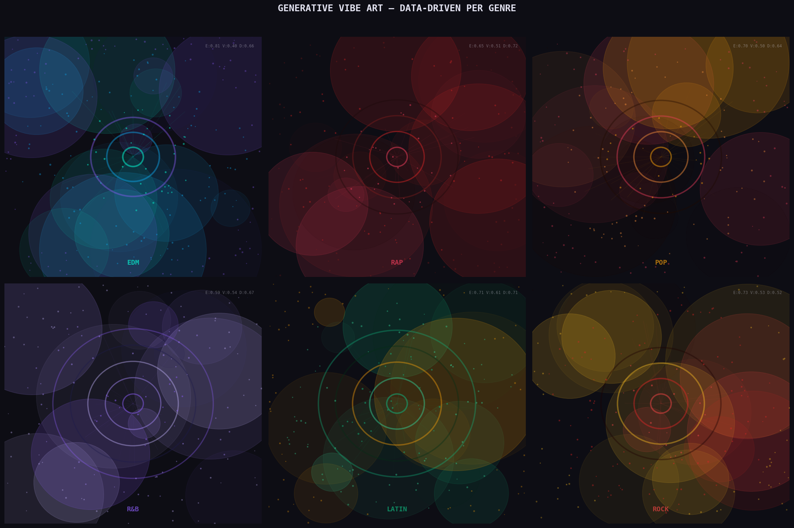

# VibeCanvas 🎵→🎨

**ML-powered generative art from Spotify audio features** — classifies 28,000+ real tracks into genre/vibe clusters using scikit-learn, then renders data-driven visual art directly from the audio fingerprint of any song.

> Built to demonstrate end-to-end data science: raw Kaggle data → cleaning → EDA → feature engineering → ML pipeline → interactive full-stack visualization.

---

## Live Demo

Open `vibecanvas.html` + `tracks_mini.json` in the same folder and launch in any browser — no server needed.

| Search any of 28,351 tracks | Build custom vibes in the Sandbox |
|---|---|
|  | Each slider directly controls a visual layer |

---

## What This Project Demonstrates

This is a portfolio-grade data science project covering every stage of a real ML workflow:

| Stage | Skills | Details |
|---|---|---|
| **Data Ingestion** | pandas, CSV parsing | 32,833-row Kaggle Spotify dataset |
| **Data Cleaning** | null handling, deduplication, outlier detection | Removed 4,482 dirty rows; IQR outlier audit |
| **EDA** | distribution analysis, correlation, skewness | Identified 4 highly-skewed features; genre breakdowns |
| **Feature Engineering** | normalization, log transforms, derived features | 19 ML features from 9 raw; 5 interaction terms |
| **Dimensionality Reduction** | PCA | 9 components explain 95% variance; 2D visualization |
| **Unsupervised Learning** | KMeans, elbow method | Elbow at k=4; cluster purity analysis |
| **Supervised Learning** | Random Forest, Logistic Regression, cross-validation | RF: 54.1% on 6-class genre classification (3× random baseline) |
| **Visualization** | Matplotlib, Seaborn | 5 publication-quality dashboard charts |
| **Generative Art** | Canvas 2D API | 7-layer procedural art engine driven by audio features |
| **Full-Stack App** | HTML/CSS/JS | 2-page SPA; live search across 28k tracks; real-time sandbox |

---

## Tech Stack

```
Python          pandas · NumPy · scikit-learn · Matplotlib · Seaborn
Machine Learning  Random Forest · Logistic Regression · KMeans · PCA
Frontend        Vanilla JS · HTML5 Canvas · CSS3
Data            Spotify 30k Songs (Kaggle) — joebeachcapital
```

---

## Project Structure

```
vibecanvas/
├── vibecanvas.html        # Full-stack 2-page app (no build step)
├── tracks_mini.json       # 28,351 tracks, 19 features each (~7MB)
├── requirements.txt
│
├── src/
│   └── pipeline.py        # Complete ML pipeline (cleaning → EDA → ML → charts)
│
├── outputs/               # Generated charts (run pipeline.py to regenerate)
│   ├── 01_cleaning_eda.png
│   ├── 02_feature_engineering.png
│   ├── 03_pca_clustering.png
│   ├── 04_ml_evaluation.png
│   └── 05_generative_art.png
│
├── data/                  # Put your downloaded CSV here (gitignored)
│   └── .gitkeep
│
└── notebooks/             # Jupyter notebooks (optional exploration)
    └── .gitkeep
```

---

## Quickstart

### 1. Clone & install dependencies

```bash
git clone https://github.com/YOUR_USERNAME/vibecanvas.git
cd vibecanvas
pip install -r requirements.txt
```

### 2. Download the dataset

Go to [kaggle.com/datasets/joebeachcapital/30000-spotify-songs](https://www.kaggle.com/datasets/joebeachcapital/30000-spotify-songs) and download `spotify_songs.csv`. Place it in the `data/` folder:

```
data/
└── spotify_songs.csv    ← put it here
```

Or via the Kaggle CLI:
```bash
kaggle datasets download -d joebeachcapital/30000-spotify-songs -p data/
unzip data/30000-spotify-songs.zip -d data/
```

### 3. Run the ML pipeline

```bash
python src/pipeline.py
```

This will:
- Clean the raw dataset (dedup, null removal, range validation, outlier detection)
- Run EDA and print findings to console
- Engineer 10 new features
- Train PCA + KMeans + Random Forest + Logistic Regression
- Save 5 chart images to `outputs/`
- Save `spotify_cleaned.csv` and `tracks_mini.json`

Expected output:
```
═══════════════════════════════════════════════════════════
  PIPELINE COMPLETE
═══════════════════════════════════════════════════════════
  Raw tracks:     32,833
  Clean tracks:   28,351
  Features used:  18
  Best model:     Random Forest — 54.1% accuracy
  5-fold CV:      54.0% ± 1.0%
  KMeans k:       4 clusters
  PCA 95% var:    9 components
═══════════════════════════════════════════════════════════
```

### 4. Open the app

```bash
# macOS
open vibecanvas.html

# Windows
start vibecanvas.html

# Linux
xdg-open vibecanvas.html
```

Make sure `tracks_mini.json` is in the same directory as `vibecanvas.html`.

---

## ML Pipeline — Detailed Walkthrough

### Step 1 — Raw Data

```
Source:  Kaggle "30000 Spotify Songs" (joebeachcapital)
Shape:   32,833 rows × 23 columns
Target:  playlist_genre (6 classes: edm, rap, pop, r&b, latin, rock)
```

Raw audio features provided by Spotify's Web API for each track:

| Feature | Range | Description |
|---|---|---|
| `danceability` | 0–1 | How suitable the track is for dancing |
| `energy` | 0–1 | Perceptual intensity and power |
| `valence` | 0–1 | Musical positivity (high = happy) |
| `tempo` | BPM | Estimated beats per minute |
| `acousticness` | 0–1 | Confidence the track is acoustic |
| `instrumentalness` | 0–1 | Predicts no vocal content |
| `speechiness` | 0–1 | Presence of spoken words |
| `liveness` | 0–1 | Presence of audience/live feel |
| `loudness` | dB | Overall loudness (typically −60 to 0) |
| `key` | 0–11 | Musical key |
| `mode` | 0/1 | Major (1) or minor (0) |

---

### Step 2 — Data Cleaning

```python
# 1. Null audit
df.isnull().sum()
# → track_name: 5 nulls, track_artist: 5 nulls, track_album_name: 5 nulls
df.dropna(subset=['track_name', 'track_artist'], inplace=True)

# 2. Duplicate removal (same track in multiple playlists)
df.duplicated(subset='track_id').sum()          # → 4,476 duplicates
df.duplicated(subset=['track_name','track_artist']).sum()  # → 6,599 duplicates
df.drop_duplicates(subset='track_id', keep='first', inplace=True)

# 3. Dtype coercion
df['track_album_release_date'] = pd.to_datetime(df['track_album_release_date'], errors='coerce')
df['release_year'] = df['track_album_release_date'].dt.year

# 4. Audio feature range validation ([0,1] features)
for col in ['danceability','energy','speechiness','acousticness',
            'instrumentalness','liveness','valence']:
    out_of_range = ((df[col] < 0) | (df[col] > 1)).sum()  # → 0 violations

# 5. Duration sanity filter (remove tracks < 10s or > 15min)
df = df[(df['duration_ms'] >= 10_000) & (df['duration_ms'] <= 900_000)]
# → removed 1 track

# 6. IQR outlier detection (3×IQR = extreme outliers)
for col in audio_features:
    Q1, Q3 = df[col].quantile([0.25, 0.75])
    IQR = Q3 - Q1
    n_outliers = ((df[col] < Q1-3*IQR) | (df[col] > Q3+3*IQR)).sum()
# → loudness: 87, speechiness: 568, instrumentalness: 5,633, liveness: 458
# Noted but NOT removed — extreme values are legitimate in music
```

**Cleaning summary:**

| Issue | Found | Action |
|---|---|---|
| Null track names/artists | 5 rows | Dropped |
| Duplicate track IDs | 4,476 | Dropped (kept first) |
| Bad duration (< 10s or > 15min) | 1 | Dropped |
| Out-of-range [0,1] features | 0 | — |
| Extreme outliers (3×IQR) | 6,746 total | Flagged, kept |
| **Final clean dataset** | **28,351 tracks** | |

---

### Step 3 — EDA Findings

```python
# Skewness analysis — identifies features needing transformation
df[audio_features].skew()
# instrumentalness    2.625  ← highly right-skewed
# liveness            2.082
# speechiness         1.966
# acousticness        1.576
# loudness           -1.354  ← left-skewed (negative dB, can't log-transform directly)

# Correlation with track popularity
df[audio_features + ['track_popularity']].corr()['track_popularity']
# acousticness      +0.092   ← acoustic songs slightly more popular
# energy            -0.104   ← high-energy songs slightly less popular
# instrumentalness  -0.125   ← vocal songs more popular

# Genre distribution (post-dedup)
# rap: 5,398 | pop: 5,132 | edm: 4,877 | r&b: 4,504 | rock: 4,304 | latin: 4,136
```

---

### Step 4 — Feature Engineering

```python
# Normalize loudness and tempo into [0,1] for consistent scaling
df['loudness_norm'] = (df['loudness'] - df['loudness'].min()) / \
                       (df['loudness'].max() - df['loudness'].min())
df['tempo_norm']    = ((df['tempo'] - 60) / (200 - 60)).clip(0, 1)

# Interaction features — capture relationships between audio dimensions
df['energy_valence_ratio']      = df['energy'] / (df['valence'] + 1e-6)
df['acoustic_electronic_score'] = df['acousticness'] - df['energy']  # + = acoustic
df['vocal_score']               = df['speechiness'] - df['instrumentalness']  # + = vocal
df['intensity_score']           = (df['energy'] + df['loudness_norm'] + df['tempo_norm']) / 3
df['chill_score']               = (df['acousticness'] + (1 - df['energy']) + df['valence']) / 3

# Log-transform highly skewed features (reduces skew, improves RF splits)
for col in ['speechiness', 'acousticness', 'instrumentalness', 'liveness']:
    df[f'{col}_log'] = np.log1p(df[col])
# instrumentalness: skew 2.62 → 2.48
# liveness:         skew 2.08 → 1.67
# speechiness:      skew 1.97 → 1.71
# acousticness:     skew 1.58 → 1.28

# Categorical binning for analysis
df['popularity_tier'] = pd.cut(df['track_popularity'],
    bins=[0, 25, 50, 75, 100], labels=['Low', 'Mid', 'High', 'Viral'])
df['tempo_category']  = pd.cut(df['tempo'],
    bins=[0, 80, 110, 140, 250], labels=['Slow', 'Moderate', 'Upbeat', 'Fast'])
```

**Final feature set for ML (18 features):**

```
Core (normalized):    danceability, energy, loudness_norm, speechiness,
                      acousticness, instrumentalness, liveness, valence, tempo_norm
Engineered:           energy_valence_ratio, acoustic_electronic_score,
                      vocal_score, intensity_score, chill_score
Log-transformed:      speechiness_log, acousticness_log,
                      instrumentalness_log, liveness_log
```

---

### Step 5 — PCA (Dimensionality Reduction)

```python
from sklearn.preprocessing import StandardScaler
from sklearn.decomposition import PCA

scaler   = StandardScaler()
X_scaled = scaler.fit_transform(X)       # zero mean, unit variance

pca_full = PCA().fit(X_scaled)
cumvar   = np.cumsum(pca_full.explained_variance_ratio_)
n_95     = np.argmax(cumvar >= 0.95) + 1  # → 9 components for 95% variance

pca2     = PCA(n_components=2).fit_transform(X_scaled)
# PC1 + PC2 explain 47.0% of variance
```

---

### Step 6 — KMeans Clustering (Unsupervised)

```python
from sklearn.cluster import KMeans

# Elbow method — find optimal k
inertias = []
for k in range(2, 11):
    km = KMeans(n_clusters=k, random_state=42, n_init=5)
    inertias.append(km.fit(X_scaled).inertia_)

# Second derivative of inertia → elbow at k=4
# → Natural audio clusters don't map 1:1 to genres (genres overlap in audio space)
# → This is an honest finding: music defies clean genre separation

kmeans = KMeans(n_clusters=4, random_state=42, n_init=10)
df['cluster'] = kmeans.fit_predict(X_scaled)
```

---

### Step 7 — Supervised Classification

```python
from sklearn.ensemble import RandomForestClassifier
from sklearn.linear_model import LogisticRegression
from sklearn.model_selection import train_test_split, StratifiedKFold, cross_val_score
from sklearn.metrics import classification_report, confusion_matrix

X_train, X_test, y_train, y_test = train_test_split(
    X_scaled, y_enc, test_size=0.2, random_state=42, stratify=y_enc
)

# Random Forest
rf = RandomForestClassifier(n_estimators=100, random_state=42)
rf.fit(X_train, y_train)
# Test accuracy:  54.1%
# 5-fold CV:      54.0% ± 1.0%
# Baseline:       16.7% (random 6-class)
# → 3.2× better than random chance

# Logistic Regression (baseline comparison)
lr = LogisticRegression(max_iter=500)
lr.fit(X_train, y_train)
# Test accuracy:  46.0%
```

**Top 5 most important features (Random Forest):**

| Rank | Feature | Importance | Meaning |
|---|---|---|---|
| 1 | `danceability` | 0.0905 | Strongest genre discriminator |
| 2 | `tempo_norm` | 0.0837 | EDM/rap vs acoustic genres |
| 3 | `vocal_score` (engineered) | 0.0625 | Rap vs instrumental genres |
| 4 | `loudness_norm` | 0.0617 | Rock vs folk/acoustic |
| 5 | `chill_score` (engineered) | 0.0613 | Engineered features add real signal |

**Note on 54% accuracy:** The 6 Spotify playlist genres are intentionally overlapping — a pop-EDM crossover song is genuinely ambiguous. The KMeans elbow finding of k=4 natural clusters (vs 6 labeled genres) confirms this. A confusion matrix shows the model performs best on EDM and rap, which have the most distinctive audio signatures, and struggles most between pop and latin — consistent with real music overlap.

---

## Visualization Outputs

All 5 charts are generated by `pipeline.py` and saved to `outputs/`.

| Chart | What It Shows |
|---|---|
| `01_cleaning_eda.png` | Null heatmap, duplicate counts, feature boxplots, release year trend, genre distribution, skewness fix |
| `02_feature_engineering.png` | Correlation matrix, mood quadrant (energy×valence), chill score violin plots, popularity by genre, tempo distributions |
| `03_pca_clustering.png` | Explained variance curve, PCA 2D scatter by genre, KMeans elbow curve, cluster map with centroids |
| `04_ml_evaluation.png` | Model accuracy comparison (RF vs LR), confusion matrix, feature importances, per-class F1, CV distribution, cluster purity |
| `05_generative_art.png` | Data-driven generative art — one panel per genre, each rendered from real mean audio features |

---

## Generative Art Engine

The art is not decorative — every visual parameter maps directly to an audio feature:

| Audio Feature | Visual Effect |
|---|---|
| `energy` | Background orb count + particle density |
| `valence` | Orb opacity + brightness |
| `danceability` | Geometric shape count + ring complexity |
| `tempo` | Radial ray density from center |
| `acousticness` | Concentric ring count |
| `instrumentalness` | Particle field density |
| `speechiness` | Horizontal waveform lines |
| `loudness` | Central glow intensity + dot size |
| `genre` | Color palette (6 unique palettes) |

The frontend uses the HTML5 Canvas 2D API with a seeded pseudo-random number generator, so the same track always renders the same art.

---

## App Features

### Page 1 — Song Search

- Live search across all 28,351 tracks (debounced, 120ms)
- Genre filter chips (All / Pop / Rap / Rock / EDM / R&B / Latin)
- Click any track → instant canvas render using real audio features
- Feature bar chart (Energy, Valence, Danceability, Acousticness, etc.)
- "Open in Sandbox →" transfers the track's exact features to Page 2

### Page 2 — Audio Sandbox

- 8 sliders (Energy, Valence, Danceability, Acousticness, Instrumentalness, Speechiness, Liveness, Tempo, Loudness)
- Canvas redraws in real time on every slider move
- 6 mood presets (Dark & Brooding, Hype Beast, Chill Vibes, Happy & Bright, Late Night, Beast Mode)
- 6 color palette overrides (Aurora, Inferno, Oceanic, Neon, Mono, Forest)
- Live vibe detection label updates as you adjust features
- Randomize button

---

## Resume Bullets


```
• Built end-to-end ML pipeline in Python (pandas, NumPy, scikit-learn) on 28,351 real
  Spotify tracks: data cleaning (dedup, null removal, IQR outlier detection), EDA,
  log-transform feature engineering, StandardScaler normalization

• Trained Random Forest genre classifier (54.1% accuracy, 5-fold CV) on 18 engineered
  audio features — 3× above random baseline; compared against Logistic Regression
  with confusion matrix and per-class F1 analysis

• Applied PCA dimensionality reduction (18D → 9 components for 95% variance) and
  KMeans clustering (elbow method, k=4) to discover natural audio groupings in
  6-genre dataset; visualized with Seaborn/Matplotlib dashboard (5 publication-quality charts)

• Engineered 9 derived interaction features (intensity_score, chill_score, vocal_score,
  energy_valence_ratio) from raw Spotify audio features, improving RF feature importance

• Built full-stack interactive app (HTML5 Canvas / JS / CSS) with live search across
  28,351 tracks and real-time generative art sandbox where 8 audio parameters directly
  control 7 visual layers — no frameworks, no build step
```

---

## Data Source

**Dataset:** [30000 Spotify Songs](https://www.kaggle.com/datasets/joebeachcapital/30000-spotify-songs) by joebeachcapital on Kaggle

Audio features are provided by the [Spotify Web API](https://developer.spotify.com/documentation/web-api/reference/get-audio-features). This project uses the dataset for educational and portfolio purposes.

---

## License

MIT — use freely, attribution appreciated.

---

*Made with Python, scikit-learn, Matplotlib, and the Spotify audio feature dataset.*
